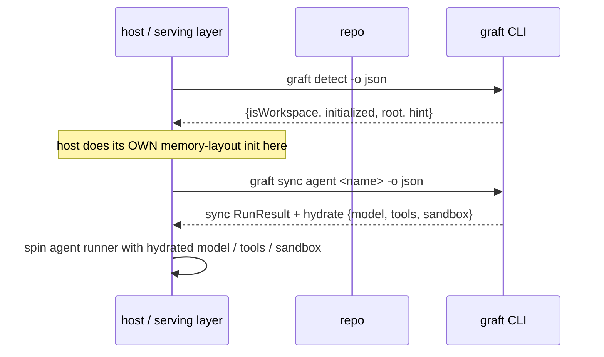

# Using graft from a host

A **host** — a serving layer or agent framework that embeds graft — consumes a workspace through two machine-readable surfaces: `graft detect` (side-effect-free) and the **hydrate view** attached to `graft agent <name> status` and a single-agent `graft sync`.

graft **never auto-syncs**. It exposes an idempotent detect probe and a sync that is safe to call, but the host decides *when* to call them. The ordering below — detect, then the host's own memory-layout init, then sync — is the **host's responsibility**, not graft's.

## The consumer contract (call sequence)



1. **Detect** the workspace (side-effect-free). If it is not a graft workspace, or not yet initialized, the host stops or falls back.
2. The host performs **its own memory-layout init**. graft does not do this and does not call back into the host — the host owns this step and its ordering.
3. **Sync** the named agent. This is the only step that writes; the host calls it explicitly after its own init.
4. Read the **hydrate view** from the structured output to spin a runner with the resolved model, tools, and provider-scoped sandbox.

## `graft detect`

`graft detect` answers "is this directory a graft workspace, and is it initialized?" from the filesystem alone. It does **not** construct the gateway, does not create `.graft/`, and does not seed git — a host can call it safely before deciding to consume graft.

```bash
graft detect -o json
```

Output is a `DetectReport`:

```json
{
  "isWorkspace": true,
  "initialized": true,
  "root": "/path/to/repo",
  "hint": ""
}
```

| Field | Meaning |
|-------|---------|
| `isWorkspace` | `true` when a `.graft/` directory exists |
| `initialized` | `true` once the canonical store (`.graft/agents/`) exists — i.e. `graft init` has run |
| `root` | the working directory the probe was run from |
| `hint` | friendly next step (`run graft init first`); empty when initialized |

The two not-ready cases both carry the same friendly hint (never a raw git error):

| State | `isWorkspace` | `initialized` | `hint` |
|-------|:-:|:-:|--------|
| Not a graft dir (no `.graft/`) | `false` | `false` | `run graft init first` |
| `.graft/` present but not initialized | `true` | `false` | `run graft init first` |
| Initialized workspace | `true` | `true` | _(empty)_ |

`-o yaml` and `-o table` are also available.

## The hydrate view

The **hydrate view** is the machine-readable resolution of one agent for a runner. It is an **additive** block: it is attached without changing the existing top-level keys of `status` or sync output, so consumers that already parse `StatusReport` / `RunResult` are unaffected — they simply gain a `hydrate` key.

It appears on:

- `graft agent <name> status` — always, for the named agent.
- `graft sync agent <name>` — only on a **single-agent** sync (a multi-agent `graft sync agents` has no hydrate block).

```bash
graft agent <name> status -o json --provider codex
graft sync agent <name>   -o json --provider codex
```

```json
{
  "name": "reviewer",
  "model": "gpt-5-codex",
  "tools": ["read", "edit"],
  "sandbox": { "sandbox_mode": "workspace-write" },
  "skills": [],
  "mcp": []
}
```

| Field | Source |
|-------|--------|
| `name` / `tools` / `skills` / `mcp` | straight from the canonical agent |
| `model` | the per-provider model when `--provider` is given (`ModelFor(provider)`), else the canonical model |
| `sandbox` | resolved **per requested provider** from that provider's overrides; omitted when there is no provider context or no sandbox knob is set |

### `sandbox` is provider-scoped, not canonical

There is no canonical `sandbox` field. `sandbox` is computed for the provider you ask for via `--provider`. Today the only recognized sandbox knob is codex's `sandbox_mode` (pulled from that agent's `providerOverrides[codex]`). Without `--provider`, the view is un-scoped: canonical model, no `sandbox`.

## Omni-agent header

An **omni agent** contributes a shared **system-instructions** header that gets prepended to another agent's canonical body. Because the header lives in the canonical body, ordinary sync fans it out to **every** provider with no per-provider work.

```bash
graft agent init <name> [prompt] --omni-agent[=<ref>]
```

`--omni-agent` is an **optional-value** flag:

- bare `--omni-agent` — the omni ref defaults to the positional `<name>`.
- `--omni-agent=<ref>` — records `<ref>`.
- `--omni-agent=` (explicit empty) — rejected as ambiguous; use bare `--omni-agent` to default to the agent name.

The reference is persisted in the agent's `.graft/agents/<name>/.meta.json` (the `omni` block: `ref`, `applied`, `supported`), so it round-trips.

When applied, the header is wrapped in a stable sentinel and prepended as the first block of `instructions.md`:

```markdown
<!-- graft:omni <ref> -->
…system-instructions…
<!-- /graft:omni -->
…original body…
```

`graft agent <name> omni --refresh` re-runs the resolver and replaces that block in place.

:::warning Current status: recorded, not yet applied
The omni run/resolve capability is **NOT YET SUPPORTED** in this build. The shipped resolver reports `supported=false`, so:

- `graft agent init <name> --omni-agent[=<ref>]` **records** the reference in `.meta.json` and prints a warning (`omni agent "<ref>" not yet supported — reference recorded, header skipped`); the body is left **untouched**.
- `graft agent <name> omni --refresh` is a clean **no-op + warning** (exit 0), never an error.

Once a resolver capability ships, the same commands prepend the sentinel-wrapped header into the body, mark the meta `applied=true`, and the next sync fans it out to every provider. The persistence, sentinel, and CLI surface are already in place; only the resolver changes.
:::

## Idempotence guarantees

- **Re-sync is byte-identical.** The omni block is ordinary Markdown to sync — it is fanned out to providers verbatim and never re-processed or stripped. A second sync with no changes leaves every provider file byte-identical.
- **The sentinel block is replaced in place, never duplicated.** Re-applying (`init` again, or `omni --refresh`) strips the existing leading graft block and writes a fresh one — the block is never duplicated or nested.
- **User content that resembles the sentinel is preserved.** Only graft's *own* well-formed leading block is recognized. A literal `<!-- graft:omni … -->` a user authored elsewhere in the body, or a malformed / half-open sentinel, is never treated as the managed block — it survives a round-trip untouched.
- An empty ref is a no-op: the body is returned unchanged.

## Related

- [Sync an agent](./sync-an-agent.md)
- [Check status](./check-status.md)
- [Change detection](../concepts/change-detection.md)
- [Canonical format reference](../reference/canonical-format.md)
- [CLI reference](../reference/cli.md)
